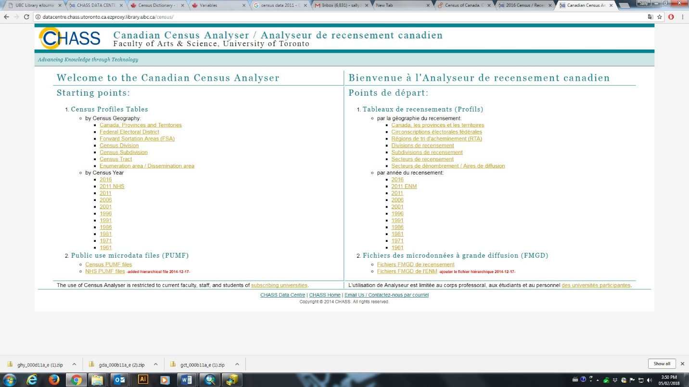
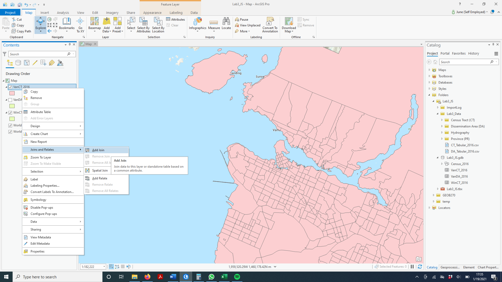

**GEOB 270 Jan 2021**

**Lab 3: Rental Affordability**

Working with Census Data:

tables, joins, classification, normalization, visualization

**Due**:

Introduction and Scenario 
==========================

Often geographers need to work with census data that is gathered,
analyzed and displayed by national government organizations (example
Statistics Canada). Census data is utilized in many geographic analysis
research projects: urban planning, immigration, social geography,
environmental justice, crime prevention, transportation planning, policy
analysis, etc., and all of these topics can be explored using GIS.

Every 5 years, Canadians are surveyed. Previous to the 2011 survey, 80%
of the population completed the 'short form' and 20% of the population
completed the 'long form', where more detailed information is captured.
In particular, the 'long form' included socio-economic data including
income, dwelling type and value (the topic of this lab), transportation
data (modes of transportation for commuting) and immigration data. The
former Canadian conservative government changed census policy for 2011;
the long form was not mandatory but voluntary. This has impacted the
quality of the data, and makes it challenging to compare to previous
years. The 2011 Census is referred to now as 2011 NHS for national
household survey. The next survey was conducted in 2016, with the long
form reinstated for 20% of the population, and the data was released in
the fall of 2017. The next census will be in 2021.

For this lab, we will use 2016 Census data to assess rental housing cost
and affordability in Metro Vancouver and Winnipeg. Statistics Canada
creates and maintains both map and tabular data. The census map spatial
areas are based upon population. In large Census Metropolitan Areas
(CMA) like Metro Vancouver, Toronto and Winnipeg there are 3 different
scales, or resolution, for the data: data summarized for the whole CMA,
Census Tracts (CT) and Census Dissemination Areas (DA). Statistics
Canada draws census boundaries on maps for CT and DA based upon the
number of people living in the area. DAs are finer resolution with a DA
being sometimes less than a city block, sometimes just an apartment
building, whereas CTs are coarser resolution, and one CT makes up a few
city blocks.

> For this lab, you will learn how to access and download Canadian
> census data: both spatial maps files for CTs and DAs, and variables in
> tabular files, and for 2 different cities: Metro Vancouver and
> Winnipeg. You will visualize and work with rental cost data exploring
> various methods for classifying quantitative data (monthly cost of
> rent) for Metro Vancouver CTs and Das, comparing the monthly costs to
> Winnipeg, and then looking at another rental indicator: the percent of
> people in each DA that spend \> 30% of their income on rent.

**The scenario**: you are a data journalist and need to compile some
publishable maps to accompany an article on cost of rental housing in
Metro Vancouver, and comparing this to Winnipeg.

Learning Objectives and Tasks 
==============================

Part 1 - Developing a working knowledge of Canadian Census Data

a)  Downloading Spatial and Tabular Census Data

b)  Join tabular data to spatial layers

c)  Visualizing rental housing data

d)  Terms of Canadian Census Data collection

> Part 2 - Understanding quantitative data classification (for Metro
> Vancouver CT rental housing cost) Creating a map to illustrate the
> difference between 4 methods of classification: a) natural breaks,

b)  equal interval,

c)  standard deviation and

d)  manual breaks

> Part 3 -- Working with ratios: Standardizing data for comparison
> (standardizing housing by income and comparing Metro Vancouver to
> Winnipeg).

Part 1 - Setting up your workspace 
===================================

Generally speaking, when starting any ArcPro project, you:

1.  Set up a workspace (ex. c:\\temp\\lab\#\_YourName)

2.  In c:\\temp\\lab\#\_YourName, create a folder called lab\#\_Data

    -   Put any downloaded data into
        c:\\temp\\lab\#\_YourName\\lab\#\_Data

3.  Import the data into your project geodatabase, ArcPro automatically
    creates a geodatabase for you in your new workspace named
    lab\#\_YourName.gdb

    -   [A Geodatabase is a file storage system designed specifically
        for ESRI products (ArcPro, ArcGIS,
        etc.).](https://pro.arcgis.com/en/pro-app/latest/help/data/geodatabases/overview/what-is-a-geodatabase-.htm)

        -   They are optimized for storing and managing geospatial data
            and have unique functionality that allows you to set rules
            to enforce data integrity. For instance, geodatabases allow
            you to set
            [Domains](https://pro.arcgis.com/en/pro-app/latest/help/data/geodatabases/overview/create-modify-and-delete-domains.htm).
            Here is good **example** of when you might want to set a
            Domain:

            -   You are responsible for managing a network co-op weather
                data for metro Vancouver. Volunteers (mostly retires)
                record daily precipitation totals from a manual rain
                gauge and enter it using and website that inputs into
                your database automatically. You could set a rule that
                **all entries must be a positive number.** It is
                impossible to have negative precipitation, so you could
                set a database rule to prevent simple typos from causing
                data errors.

    -   By importing your data into your geodatabase and leaving a
        backup copy in your lab\#\_Data, you can easily find a backup
        copy or your original data if you make a mistake.

4.  Continue with analysis

Part 2 - Working with Canadian Census Data
==========================================

a) Downloading Spatial and Tabular Census Data 
-----------------------------------------------

One can download this data from Statistics Canada. However, for our lab,
you will download the census data from both UBC library (spatial map
files) and the University of Toronto census data site (tabular files).
These sites have made it easier to download the data. Please note --
these sites are only available to you as UBC students. You will find,
download and extract:

-   Spatial data -- Metro Vancouver CT and DA census boundary maps, and
    Winnipeg CTs for 2016.

-   Tabular data - *shelter rental cost* and \> 30% income spent on rent
    for both CTs and DAs

### i) Accessing *Census map shapefiles* for Canada 

We will use the UBC Library.

1.  Go to the Abacus Dataverse Network (http://data.library.ubc.ca/) and
    search for 'Census Canada 2016 boundary files'. The page will
    probably ask you to login.

2.  This finds the entry to the Census Canada Cartographic boundary
    files. Click on link and then on "Data & Analysis" tab to download
    individual files. The link has access to the different census
    boundary units.

3.  For this lab, you need to download:

    -   lct\_000b16a\_e.zip which are all the CT boundaries for CMAs in
        Canada

    -   lda\_000b16a\_e.zip which are all the DA boundaries for CMAs in
        Canada

4.  Start ArcPro, setup your workspace following Part 1 steps 1&2:

    -   Extract the 2 .zip files into your workspace
        c:\\temp\\lab3\_YourName\\lab3\_Data

    -   **\*\* Do not** extract the data directly into your geodatabase

5.  Right click lab3\_YourName.gdb and click New\>Feature Dataset

    -   A [Feature
        Dataset](https://pro.arcgis.com/en/pro-app/latest/tool-reference/data-management/create-feature-dataset.htm).
        A Feature Dataset is a group of [Feature
        Classes](https://pro.arcgis.com/en/pro-app/latest/tool-reference/data-management/create-feature-class.htm).
        That share common properties (ex. Projections). A Feature Class
        is special type of shapefile (Vector Data) that works well
        within a geodatabase. You can essentially think of Feature Class
        as a shapefile within a Geodatabase. At least the context of
        ArcPro.

    -   Name the Feature Dataset CensusBoundaries

    -   Choose the Canada Lambert Conformal Conic (LCC) Projection from
        the dialog box under Projected coordinate systems \>
        Continental \> North America

        -   This is the default projection used by Statistics Canada, it
            is well suited for displaying the whole country. The layers
            we downloaded are already in the LCC projection.

        -   However, if we wanted to import a layer that was in a
            different projection, importing into the CensusBoundaries
            would **automatically reproject the data** into LCC.

6.  Right-click on your CensusBoundaries Feature Dataset. And select
    **import** Feature Class(es).

    -   Add the two downloaded files you extracted into lab3\_Data as
        Input Features then click run

7.  In CensusBoundaries rename the layer name lct\_000b16a\_e to
    CanadaCT\_2016 *(gently left click on layer name until you are
    allowed to edit name)*.

    -   Do the same for the other layer: lda\_000b16a\_e to
        CanadaDA\_2016

8.  Now add the layers to your map and arrange them so CTs are on top
    and DAs are below them.

#### QUESTION 1 (5) 

> Referencing the links and information above, why is it important to
> work within a Geodatabase when using ArcPro? Give an example of when
> you might want to use a Domain.

#### QUESTION 2 (1) 

> What is the default map projection for all data from Statistics
> Canada?

#### QUESTION 3 (1) 

> Zoom out so you can see the whole country. Turn on and off the DA and
> CT layers to compare them. Zoom into the Metro Vancouver area and do
> the same thing. What are two differences you notice?

### ii)Extracting out Metro Vancouver and Winnipeg 

Because of the volume of data, and because we are interested in Metro
Vancouver and Winnipeg only, it will be easier for our analysis and
mapping to extract into separate layers Metro Vancouver and Winnipeg.

1.  Right click on CanadaCT\_2016, choose Data\>Export Features. This
    will open the Feature Class to Feature Class tool. We can use it to
    query a subset of the data and save it as a separate filed.

2.  Set Input Features to CanadaCT\_2016

3.  Output Location: lab3\_YourName\\lab3\_YourName.gdb\\Census\_2016

4.  Output Feature Class: WinCT\_2016

5.  Click New expression

    -   Where: CMANAME; Is equal to; Winnipeg

6.  Run.

7.  Change the Output Feature Class: VanCT\_2016

8.  Change the expression to: Where: CMANAME; Is equal to; Vancouver

9.  Run Again.

10. Change the Input Features to CanadaDA\_2016

11. Change the Output Feature Class: VanDA\_2016

12. Run Again

> Once you have finished this, you should have added these three layers:
> **VanCT\_2016, WinCT\_2016, and VanDA\_2016** to your Census\_2016
> Feature Dataset. Right click CanadaCT\_2016 and CanadaDA\_2016 to
> remove them from the map.

### iii) Downloading *census tabular data* from University of Toronto CHASS site 

For our scenario, we need to download census tabular data for Vancouver
and Winnipeg Census Tracts (CT) for and for Vancouver Dissemination
Areas (DA)

-   *Median Income*

-   *Total Population*

-   *Median monthly shelter costs for rented dwellings*: median (not
    average) monthly cost of rent. This data represent tenants, or
    renters

#### QUESTION 4 (2) 

> What is the difference between median and average? Why for this
> analysis is it better to use median cost of dwelling and not average?
>
> University of Toronto has organized census data from Statistics Canada
> into an interactive easy to use web site (CHASS), that can be accessed
> through the UBC library:
> [[http://resources.library.ubc.ca/page.php?id=521]{.underline}
> ](http://resources.library.ubc.ca/page.php?id=521)

1.  once at the CHASS site from the Canadian Census Analyser, you have
    two options -- pick tables by geography or year, we will pick by
    year

2.  Under year you will see **2016**

3.  {width="7.284722222222222in"
    height="4.097916666666666in"}Then pick ***Profile of census tracks*,
    o**n the next page you

4.  **Step 1 Specify Census Geography for retrieval:**

    a.  For geography uncheck A and check V & W

    b.  Then check Vancouver and Winnipeg and ensure your geography
        selection box looks like above

5.  **Step 2: Specify Census Profile variables for retrieval**

    c.  **U**nder Population and Dwellings

    d.  Now you need to pick your Profile Variables for Vancouver, cost
        of Housing

        i.  Check *Population, 2016*

    e.  Now click the Housing tab

        ii. Make sure the vertical bar Total Sex is selected

        iii. From the list of variables, check *Median monthly shelter
            cost for rented dwellings*

    f.  Now click the Income tab

        iv. Under Income -Total Sex

        v.  {width="6.972916666666666in"
            height="3.529861111111111in"}Choose Median total income in
            2015 among recipients (v1868), see below.

6.  **Step 3: Specify the output details and submit query**

    g.  Scroll to the bottom and ensure that the three variables are
        checked under Selected Items

    h.  Under Download to file choose Comma Separated Values (CSV). CSV
        files are a common format for storing tabular data that are easy
        to read/edit in applications like excel or notepad and can also
        be input into GIS.

    i.  Click Submit Query

{width="7.284722222222222in"
height="3.9458333333333333in"}

7.  Click link to download data file

    j.  Open the file using either excel

    k.  Look at the data, inspect the column headers. Note they aren't
        very descriptive.

    l.  Switch back to the Data Request Summary Page

    m.  They list the variables corresponding to each column on this
        page. You can download them as a text file or just look at the
        table.

        vi. Use columns with the following variable names: GEOU\_ID,
            Population, Housing, and Income.

        vii. After you have renamed the columns, save the file in
            lab3\_YourName\\Data as CT\_Tabular\_2016

> **Repeat this process for Greater Vancouver DA**.

1)  To switch to Dissemination Areas, click the 2016 button in the top
    right

{width="7.284722222222222in"
height="1.2337664041994751in"}

2)  Choose Profile of Dissemination Areas

3)  [Note]{.underline}: The DA name you are selecting for is Greater
    Vancouver, so check G instead of V.

{width="2.3111439195100614in"
height="1.720255905511811in"}

4)  Select the same variables

5)  Download and open.

6)  Edit the column headers

7)  Name it: DA\_Tabular\_2016

c) Join the tabular data of census information to spatial layers for GIS analysis and display 
----------------------------------------------------------------------------------------------

You now have to join the spatial data (VanCT\_2016) with the
corresponding tabular data (CT\_Tabular).

1)  Zoom in on Metro Vancouver

2)  Open the VanCT\_2016 attribute table

3)  Right click on VanCT\_2016 \> Joins and relates \> Add Join

{width="2.9675328083989503in"
height="2.7467530621172354in"}

4)  Set the inputs for the Add Join pane as shown below. You might
    notice a warning next to CTUID. Hover the mouse over the waring to
    see what it says. Clicking the bold warning code will take you to
    the ArcPro help page for the issue.

    -   We can ignore this warning, its telling us a way we can speed up
        our joins. But we're not working with files that are large
        enough for it to matter.

{width="4.162338145231846in"
height="2.7342957130358707in"}

5)  Click Run

6)  Check the Attribute Table

#### Question 5 (1)

What values do you see listed under Income?

7)  Hmm, things didn't work out how we wanted! We'll have to
    troubleshoot the issue

    -   Often times, when attempting a join, you might run into the
        issues with data types.

8)  In the catalog pane, navigate to CT\_Tabular\_2016

    -   Right click\> Add to Current Map

9)  Right click on it in the Table of Contents and Open it. Another
    table window will appear.

10) Hover your mouse over the GEO UID column header

    -   This will bring up a small box with info on the variable,
        including data type, default vale, etc.

    -   Take note of the data type

11) Switch back to the VanCT\_2016 table

    -   Take note of the Datatype for CTUID

#### Question 6 (1)

> What are the data types for \[GEO UID\] and \[CTUID\]

12) They're different! We need to make them the same.

    -   Unfortunately, ArcPro doesn't allow you to change a columns data
        type.

    -   Instead, we can create a new column, with the new data type, and
        copy the values over to it.

    -   To fix this, we're going to add a copy of CT\_Tabular\_2016 to
        Lab3\_YourName.gdb, and add a **New Column**

13) Right click on VanCT\_2016 \> Joins and relates \> Remove Join

14) Remove CT\_Tabular from your Table of Contents

> **SAVE YOUR WORK! **
>
> You have finished getting DATA! So you have:

-   accessed spatial map files for Canada for CTs and DAs

-   reselected out for Metro Vancouver and Winnipeg .

-   You have downloaded data for CTs and for DA, and for Winnipeg CTs

-   You have joined these tables to the map files, and saved them as
    layers!

-   You have also added the spatial and tabular data to your
    geodatabase.

 d) Understanding Census Data 
------------------------------

1)  Open the attribute tables for VanCT\_2016 and VanDA\_2016.

2)  Use the statistics function to compare the populations of CTs and
    DAs.

    -   

To answer the questions below, either google the question, or refer to
the Statistics Canada website for information on the 2016 census,
including definitions and descriptions of:

-   Census spatial units like Census Tracts and Disseminations Areas
    (under Geography) and census tabular data (variables/profiles)

> [[https://www12.statcan.gc.ca/census-recensement/2011/ref/dict/top-them-index-eng.cfm]{.underline}
> ](https://www12.statcan.gc.ca/census-recensement/2011/ref/dict/top-them-index-eng.cfm)

-   Tabular data (variables)
    [[http://www.statcan.gc.ca/concepts/definitions/index-eng.htm]{.underline}
    ](http://www.statcan.gc.ca/concepts/definitions/index-eng.htm)

> • Data suppression and data confidentiality
> [[https://www12.statcan.gc.ca/nhs-enm/2011/ref/DQ-QD/guide\_2-eng.cfm]{.underline}
> ](https://www12.statcan.gc.ca/nhs-enm/2011/ref/DQ-QD/guide_2-eng.cfm)

#### QUESTION 5 (1) 

> Approximately how many people are in each Census Tract (CT)?
>
> (Any answer within the range of typical values will count) QUESTION 6
> (1)
>
> Approximately how many people are in each Dissemination Area (DA)?
>
> (Any answer within the range of typical values will count)

d) Displaying rental data 
--------------------------

For **VanCT\_2016join**, symbolize rental cost by clicking:

-   *Symbology *

-   Choose *Graduate Colors* from the drop-down menu

-   *Field* is monthlyrent

-   Use defaults

You can add and symbolize other layers (water, provinces etc) and next
in the lab you will look at different options for classification and
symbolization.

Now do the same for the **VanDA\_2016join**, using the same symbology.

You have some zeros.... How can there be no rental cost of housing? Read
on.

### QUESTION 7 (1) 

> Statistics Canada has rules for data (area) suppression (i.e. not
> publishing the results of census information in certain census areas).
> What is the minimum number of survey responses or people in a census
> area that is required in order for statistics Canada to publish the
> data variable averages for that area?

### QUESTION 8 (2) 

> For the VanCT\_2016join, there are some "0" values recorded for
> monthly rental cost.
>
> What percent of Metro Vancouver CTs do the '0's represent? (Round your
> answer to the nearest tenth of a percent)

### QUESTION 9 (2) 

> For the VanDA\_2016join, there are also many 2016 DAs that have 0s.
>
> What percent of DAs does this represent? (Round your answer to the
> nearest tenth percent)

### QUESTION 10 (1) 

What may be a reason that there are so many CTs and DAs that have no
publishable data for rental income?

### QUESTION 11 (3) 

Why are there so many more DAs than CTs that have 0s for rental data?

Discuss some pros and cons for using CTs versus DAs for GIS analysis of
census data.

Part 2: Understanding quantitative data classification 
=======================================================

Creating a map to illustrate the difference between 4 methods of classification: a) natural breaks, b) equal interval, c) standard deviation and d) manual breaks 
------------------------------------------------------------------------------------------------------------------------------------------------------------------

> **Methods for classifying dwelling cost for Metro Vancouver CTs**

There are many different methods to classify quantitative data. The
default method in ArcGIS Pro is natural breaks---which looks for natural
groupings in the data, as observed in plotting a histogram of the data,
to come up with a classification based on the number of classes that you
specify. The default number of classes is 5. You will often see results
of GIS analysis that simply use these defaults. Unfortunately, natural
breaks isn't always the most accurate or appropriate method of
classifying data.

> For this section of the lab, you will classify rental cost with 3
> automated methods: Natural Breaks, Equal Interval and Standard
> Deviation, and then you will use Manual Breaks to add your own class
> breaks instead of computer generated class breaks. You will compare
> all of your results. We will use median monthly cost (monthlyrent) as
> our variable.

a)  Map 1: Natural Breaks (Default Classification, 5 classes)

    -   *Insert* a new Map

    -   Rename the Map **rent\_NB** (for natural breaks)

    -   Copy the VanCT\_2016join layer to the new Map data frame

    -   If the layer is not projected properly, you need to go into Map
        *properties* and project the coordinates to UTM zone 10

    -   Right Click on VanCT\_2016\_project (in the rent\_NB data
        frame), select *Symbology* and click on graduated colours.
        Ensure that the classification method is Natural Breaks and that
        the number of classes is 5

    -   Symbolize with a colour ramp or your choice -- pick one that
        goes from light to dark to help the map read understand this
        quantitative data.

    -   Click on histogram -- there are a number of values of 0 due to
        data suppression. These 0 values are included in the
        classification method as cost of housing = 0 which we know is an
        error. They really represent no data. We need to exclude these
        records from the data before we classify them. This is a common
        problem in mapping and data classification. Ensure when you are
        making and evaluating maps in the future that you check to see
        is the null values have been excluded

    -   Exclusion:

        -   In the Symbology pane, click the menu button in the top
            right corner. Choose display filters

        -   Select add display filter, the Add Clause. Similar to the
            queries you have done previously, select where monthly rent
            is greater than 0

b)  Map 2: Equal Interval Classification

    -   *Insert* a new Map DataFrame

    -   Rename the Map '**rent\_EI**' (By slowly left clicking twice on
        the layer title)

    -   Copy the VanCT\_2016join layer to the new data frame

    -   If the layer is not projected properly, you need to go into
        *properties* and project the coordinates to UTM zone 10

    -   Right click on VanCT\_2016join and Symbology and click on
        Classify and ensure that the classification method is Equal
        Interval and that the number of classes is 5. Check that the
        exclusion of 0s is still active if it is not (it should be).

    -   Symbolize with the same colour ramp.

    -   Look at the histogram. It should be clear why the classification
        method is called Equal Interval. *Note: You can get a better
        look at the histogram if click on the edge of the symbology pane
        and drag to expand it across the window.*

c)  Map 3: Manual Breaks

    -   *Insert* a new Map

    -   Rename the Map '**rent\_MB**' (By slowly left clicking twice on
        the layer title)

    -   Copy the VanCT\_2016join layer to new data frame

    -   If the layer is not projected properly, you need to go into
        *DataFrame properties* and project the coordinates to UTM zone
        10

    -   Ensure that the classification method is Manual and that the
        number of classes is 5 ● Under Classes, insert the following
        Upper values:

> 500
>
> 1000
>
> 1500
>
> 3000
>
> Your last break should automatically go to the highest value in your
> dataset (you can change the labels, so they don't contain any decimal
> places

-   Check that the exclusion of 0s is still active

-   Symbolize with the same colour ramp.

<!-- -->

-   Look at the histogram

d)  Map 4: Standard Deviation Classification

    -   *Insert* a new Map

    -   Rename the Map '**rent\_SD**' (By slowly left clicking twice on
        the layer title)

    -   Copy the VanCT\_2016join layer to the new data frame

    -   If the layer is not projected properly, you need to go into
        *properties* and project the coordinates to UTM zone 10

    -   Ensure that the classification method is Standard Deviation. It
        will then automatically change the number of classes to one
        standard deviation, but the number of classes will vary
        depending upon the distribution of the data. Think about this.

    -   Use a deviating color scheme for Standard Deviation

    -   Look at the histogram of class breaks

### [Create a layout view of all 4 classification methods for MetroVancouver CTs]{.underline} 

Create 4 maps in layout view

-   On the Insert tab, select new layout, choose letter size

-   Rename it 'Map of Rent by Classification Methods'

-   Under Insert, Map frame, you should see each of your map frames
    listed (with small images) select the first one

-   Now mouse over to your blank layout, using the cursor, click and
    drag to form a box, and your map frame will appear on the page.

-   Add the other 3 map frames to the page as well.

-   Resize and scale maps to approximately 1:800,000 to 1,000,000 (scale
    shown at bottom of screen)

-   Take a minute to explore the Layout tab on the navigation ribbon,
    there you will have access to tools allowing you to 'zoom in',
    center maps within their frame, and change the orientation between
    landscape and portrait.

-   Add a text box with the classification method used for each map
    (Under Insert\> Text\> Rectangle)

-   Add scale bar, north arrow (You only need one scale bar & north
    arrow, just ensure that all data frames are set to the same scale),
    legend (make sure each data frame has a legend, and the legend is
    the one that corresponds to that data frame), name, coordinate
    system info and data source. All the standard map elements.

-   **Save your project! **

### QUESTION 12 (10) 

> Export your Map layout of the 4 classifications as a PDF called
> "lab4dataclass.pdf" (Under share select Export \> Layout)

### QUESTION 13 (4) 

> Since you are a journalist, putting together maps of rental cost in
> Metro Vancouver, which classification method would you choose for your
> audience and why?

#### Create a housing cost map comparing Metro Vancouver and Winnipeg 

You are going to create a pdf for publishing in the Globe and Mail of
the 2 maps comparing Metro Vancouver and Winnipeg rental costs.

-   Activate the Winnipeg Map frame

-   symbolize Winnipeg rental using the same manual breaks
    classification as Vancouver. (you have to type in 2,000 2 times
    because of the high cost in Vancouver means an empty class for
    Winnipeg in highest class.)

-   Insert a new layout frame

-   Edit the legend values (in symbology pane -- double click on labels
    to edit) to round them to make them more readable ● Include in your
    layout:

    -   Title and sub-titles o Legend o Scale o North arrow

    -   Source statement

    -   Name

> **Save your work! **
>
> QUESTION 14 (6)
>
> Export your map as a PDF called "rentcostVM.pdf"

### QUESTION 15 (3) 

> Why should you use Manual Breaks, rather than Natural Breaks, to
> compare two cities such as Winnipeg and Vancouver?

Part 3: Working with percents and ratios to compare datasets 
=============================================================

Normalizing data to determine housing affordability 
----------------------------------------------------

So far we have looked at the monthly rent cost in Vancouver and
Winnipeg. We will now consider another indicator of cost of shelter --
in relation to income, how much of a total household income goes towards
rent.

> **Rental Shelter costs and affordability from Statistics Canada: **

-   About 3.3 million households (25.2%) spent 30% or more of their
    total income on shelter--- which is the threshold defined by the
    Canada Mortgage and Housing Corporation (CMHC) to measure housing
    affordability.

-   Households with shelter costs exceeding the affordability threshold
    paid an average of \$1,259 per month---exceeding 30% of their
    household total income by an average of \$510 per month.

-   About half a million (557,435 or 13.7%) tenant households lived in
    subsidized housing.

-   Just over one-third (36.9%) of tenant households in subsidized
    housing paid 30% or more of total income towards shelter costs.

-   Lone-parent households and non-family households were more likely to
    pay 30% or more of total income towards shelter costs---about twice
    the proportion of couple-family households.

### [Create a rental affordability map for Vancouver CTs]{.underline} 

\*Return to your MVancouver Map Frame

Assuming that you have already selected out the 0s as no data (you may
need to reset the display filter):

-   For VanCT\_2016 \> *Symbology \> graduated colors* o *Value*
    **per30inc**

> o *Classify \> **Manual***
>
> ▪ ***4** classes* ▪ *Break Values:*
>
> **25 **
>
> **50 **
>
> **75**
>
> **Last value will be highest value in ratio** o **OK**

-   Change the class colours to a colour scheme that shows affordable,
    and then various ranges of unaffordable

> [Create an affordability map for Winnipeg CTs]{.underline}

-   Follow the same steps as you did for the Vancouver CTs

### [Create publishable maps comparing affordability Vancouver to Winnipeg using Affordability percent]{.underline} 

> ● Insert a new layout, rename it Map of Rental Affordability ● Create
> a layout of Winnipeg and Metro Vancouver affordability ● Include in
> your layout:
>
> o Title and sub-titles o Legend o Scale o North arrow o Text box
> explaining the affordability ratio.

### QUESTION 16 (6) 

> ● Export your layout as a PDF called "affordability.pdf"
